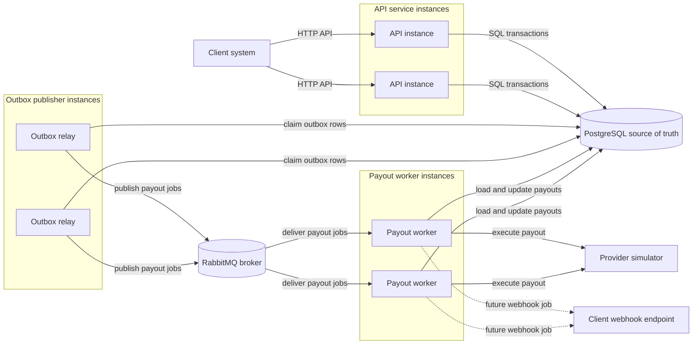
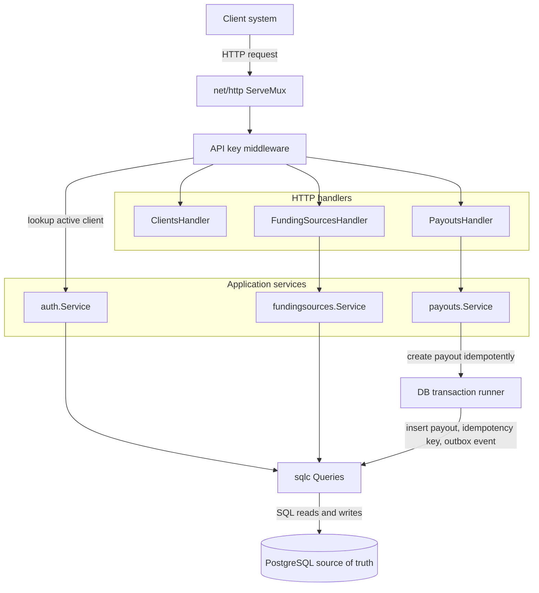
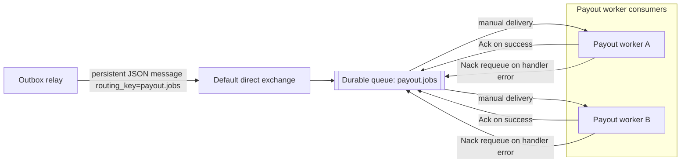
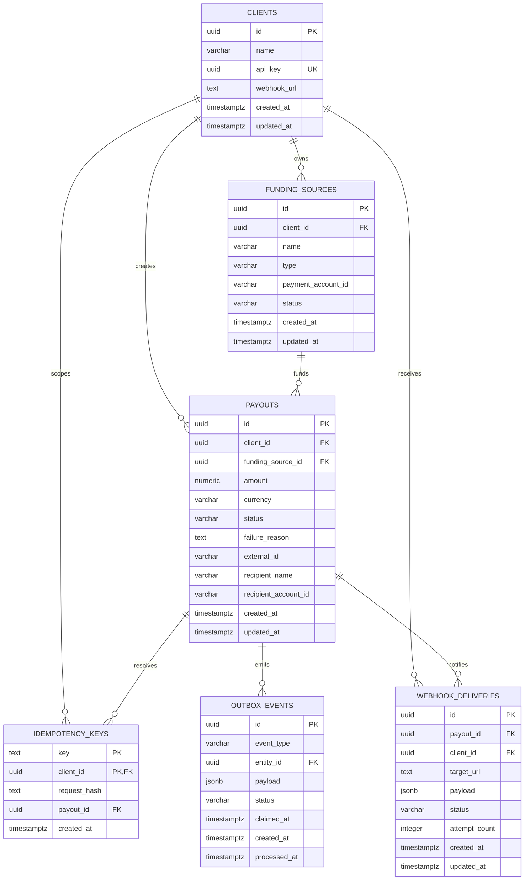

# Payout Orchestrator — System Design

## 1. Goal

Build a payout orchestration platform that accepts payout requests from client systems, validates them, stores them reliably, processes them asynchronously, and reports final status back to clients.

The system is intended as a backend-heavy, production-style pet project focused on:

- Go backend architecture
- PostgreSQL
- RabbitMQ
- Redis
- MongoDB
- async processing
- idempotency
- outbox pattern
- distributed workers

---

## 2. Problem Statement

Clients need a reliable way to initiate payouts to their end users.

Without an orchestration layer, the client must solve several hard problems on its own:

- provider integration
- retries
- duplicate request protection
- payout state tracking
- webhook delivery
- auditability
- support/debugging

This system abstracts those concerns behind a single API and a controlled internal workflow.

---

## 3. High-Level Scope

### In scope

- client authentication via API key
- funding source registration
- payout creation
- idempotent payout requests
- asynchronous payout processing
- transactional outbox
- outbox publisher
- RabbitMQ-based work distribution
- payout worker
- provider simulator integration
- webhook delivery
- audit logging
- retry-ready architecture

### Out of scope for v1

- real blockchain signing
- real custody integration
- KYC/AML
- UI/dashboard
- billing
- multi-provider routing logic
- Kafka
- advanced RBAC

---

## 3.1 Design Documentation Maintenance

This document is the source of truth for the intended architecture.

When the architecture changes, the same change must update both:
- the textual description of the affected design
- the diagrams that represent that design

This applies to service boundaries, runtime instance types, database ownership,
messaging topology, persistence flows, retry/recovery behavior, and externally
visible API behavior.

If prose and diagrams disagree, the design update is incomplete.

---

## 4. Core Business Concept

A payout is a transfer initiated by a client business to one of its end users.

### Actors in the money flow

- **Client** — the business using the platform
- **Recipient** — the end user receiving funds
- **Platform** — the orchestrator, not the owner of funds
- **Provider/Simulator** — the external system that executes the payout

### Important clarification

The platform does not own funds.

The client registers a **funding source**, which represents a delegated payout channel. The system then uses that funding source to instruct the provider to execute the payout.

---

## 5. Actors

### 5.1 Client System
An external system integrating with the API.

Responsibilities:
- create funding sources
- create payouts
- query payout status
- receive webhooks

### 5.2 Client Operator
A human on the client side.

Responsibilities:
- configure integration
- inspect payout status
- investigate errors

### 5.3 API Service
Entry point of the platform.

Responsibilities:
- authenticate requests
- validate inputs
- enforce idempotency
- persist records
- write outbox events

### 5.4 Outbox Publisher
Internal worker.

Responsibilities:
- poll outbox events from PostgreSQL
- publish them to RabbitMQ
- mark them as published

### 5.5 Payout Worker
Internal worker.

Responsibilities:
- consume payout jobs from RabbitMQ
- load payout and funding source
- call provider simulator
- persist result

### 5.6 Webhook Worker
Internal worker.

Responsibilities:
- send outbound webhooks
- record delivery attempts
- support retry-ready flow

### 5.7 Payout Recovery Service
Internal service.

Responsibilities:
- detect payouts stuck in `processing`
- reconcile stale processing state into `awaiting_retry` or terminal `failed`
- support safe replay for uncertain execution outcomes

### 5.8 Provider Simulator
External execution service used in v1.

Responsibilities:
- simulate payout execution
- return success/failure
- emulate provider behavior

---

## 6. Functional Requirements

### FR-1 Client authentication
The system shall authenticate client requests using an API key.

### FR-2 Funding source registration
The system shall allow a client to register a funding source that can later be used for payouts.

### FR-3 Funding source ownership
Each funding source shall belong to exactly one client.

### FR-4 Payout creation
The system shall allow a client to create a payout request.

### FR-5 Idempotency
The system shall support idempotent payout creation using an idempotency key.

### FR-6 Async processing
The system shall process payouts asynchronously.

### FR-7 Status tracking
The system shall store and expose payout status.

### FR-8 Webhook delivery
The system shall notify the client about payout result via webhook.

### FR-9 Auditability
The system shall preserve technical/audit data required for investigation.

### FR-10 Failure tolerance
The system shall not lose payouts if RabbitMQ is temporarily unavailable.

---

## 7. Non-Functional Requirements

### Reliability
- no duplicate payout creation for the same idempotent request
- no loss of payout jobs due to broker unavailability
- replay-safe delivery from DB to queue

### Observability
- structured logs
- correlation by payout_id and client_id
- traceable payout lifecycle

### Scalability
- multiple API instances
- multiple outbox publishers
- multiple payout workers
- multiple webhook workers

### Maintainability
- clear service boundaries
- SQL-first persistence approach
- explicit migrations

---

## 8. Data Stores and Their Roles

### PostgreSQL
Source of truth.

Used for:
- clients
- funding_sources
- payouts
- idempotency_keys
- outbox_events
- webhook deliveries metadata

### RabbitMQ
Work distribution layer.

Used for:
- payout processing jobs
- webhook jobs

### Redis
Auxiliary acceleration layer.

Used for:
- optional idempotency cache
- rate limiting
- temporary coordination helpers

Note: Redis is not the source of truth.

### MongoDB
Semi-structured technical/audit storage.

Used for:
- raw provider request/response payloads
- raw webhook payloads
- debug/audit documents

---

## 9. Services Overview

### 9.1 API Service
Responsibilities:
- receive HTTP requests
- authenticate client by API key
- validate request payloads
- verify funding source ownership and compatibility
- enforce idempotency
- create payout records
- write outbox events in the same transaction

Does not:
- execute payouts
- talk directly to RabbitMQ in the critical path
- wait for final payout outcome

### 9.2 Outbox Publisher
Responsibilities:
- poll `outbox_events` from PostgreSQL
- publish events to RabbitMQ
- update outbox status

Why it exists:
- solves the gap between DB commit and broker publication
- allows accepting payouts even if RabbitMQ is temporarily unavailable

Layer ownership:
- outbox publisher workflow belongs to application/service layer
- RabbitMQ connection/channel/publish/consume primitives belong to `internal/platform/rabbitmq`
- application services depend on transport interfaces, not AMQP concrete types

### 9.3 Payout Worker
Responsibilities:
- consume payout messages from RabbitMQ
- load payout and funding source from PostgreSQL
- transition payout status to `processing`
- call provider simulator
- persist result to PostgreSQL
- write raw technical payloads to MongoDB
- create webhook outbox/job if needed

Layer ownership:
- payout worker orchestration belongs to worker/use-case packages
- worker code must not live inside `internal/platform/rabbitmq`
- transport adapter is injected into worker through narrow interfaces

### 9.4 Webhook Worker
Responsibilities:
- consume webhook jobs
- deliver webhook to client endpoint
- store delivery attempts
- later support retry and DLQ strategy

### 9.5 Payout Recovery Service
Responsibilities:
- scan payouts stuck in `processing` beyond a configured timeout
- recover stuck payouts into a retryable state (`awaiting_retry`) or a terminal failure state
- keep recovery actions idempotent and observable

Supported flows:
- worker crash after moving payout to `processing` but before persisting final status
- publish/consume races where message delivery and DB state become temporarily inconsistent
- controlled replay when provider result is unknown and requires safe re-drive

### 9.6 Provider Simulator
Responsibilities:
- accept payout instructions
- emulate external provider execution
- return deterministic or configurable success/failure

---

## 10. Why RabbitMQ If We Already Use PostgreSQL

PostgreSQL and RabbitMQ solve different problems.

### PostgreSQL solves
- durable storage
- transactional consistency
- source of truth
- outbox persistence

### RabbitMQ solves
- efficient work distribution
- push-based delivery to workers
- consumer scaling
- ack/nack semantics
- broker-level work coordination

Without RabbitMQ, workers would need to poll PostgreSQL directly and PostgreSQL would effectively become both storage and queue.

---

## 11. Why Outbox Pattern

Problem:
If API Service creates a payout in PostgreSQL and then fails before publishing a job to RabbitMQ, the payout record exists but processing never starts.

Solution:
Use transactional outbox.

### Pattern
In one DB transaction:
- insert payout
- insert outbox event

Then an independent outbox publisher eventually transfers that event into RabbitMQ.

This guarantees that once a payout commit succeeds, the intent to process it is never lost.

---

## 12. Entity Model

### 12.1 Client
Represents a business tenant using the platform.

Fields:
- id
- name
- api_key or api_key_hash
- status
- created_at
- updated_at

### 12.2 FundingSource
Represents a payout origin registered by a specific client.

Fields:
- id
- client_id
- name
- type
- network
- asset
- status
- provider
- provider_account_id
- created_at
- updated_at

Rule:
A funding source belongs to exactly one client.

### 12.3 Payout
Represents a request to transfer value from a client funding source to a recipient.

Fields:
- id
- client_id
- funding_source_id
- external_id
- recipient
- amount
- asset
- network
- status
- provider_payout_id
- tx_hash
- created_at
- updated_at

Why store both `client_id` and `funding_source_id`:
- simpler authorization
- simpler queries
- historical ownership clarity
- controlled denormalization

### 12.4 IdempotencyKey
Represents an idempotency record for payout creation.

Fields:
- client_id
- key
- request_hash
- payout_id
- created_at

### 12.5 OutboxEvent
Represents an unpublished domain event persisted in PostgreSQL.

Fields:
- id
- event_type
- entity_id
- payload
- status
- created_at
- processed_at

### 12.6 WebhookDelivery
Represents an attempt or record of outbound webhook notification.

Fields:
- id
- payout_id
- client_id
- target_url
- payload
- status
- attempt_count
- created_at
- updated_at

### 12.7 PayoutExecutionAttempt
Represents execution and retry metadata for payout worker processing.

Fields:
- payout_id
- attempt_count
- last_error_code
- last_error_message
- next_retry_at
- locked_by
- locked_at
- created_at
- updated_at

---

## 13. Payout Lifecycle

Main payout statuses:
- `pending`
- `processing`
- `awaiting_retry`
- `succeeded`
- `failed`

Transitions:
- `pending -> processing`
- `processing -> awaiting_retry`
- `awaiting_retry -> processing`
- `processing -> succeeded`
- `processing -> failed`
- `awaiting_retry -> failed`

Worker execution gate:
- payout execution is allowed only when status is `pending` or `awaiting_retry`
- `processing` is treated as an in-flight lock state, not as a retry entry point

The status model must prevent invalid transitions.

---

## 14. Funding Source Lifecycle

Suggested statuses:
- `active`
- `inactive`
- `disabled`

Rules:
- only `active` funding sources can be used for payout creation
- a funding source must match requested asset/network
- funding source ownership must match authenticated client

---

## 15. Request Authentication Model

For v1, the system authenticates clients via API key.

Suggested transport:
- `X-API-Key: <key>`

Flow:
1. API Service extracts API key from request headers
2. looks up client
3. verifies client is active
4. injects `client_id` into request context
5. handler/service logic runs under that client identity

---

## 16. Idempotency Design

Idempotency is enforced at API Service level.

Reason:
The duplicate problem appears at request intake time. If not handled there, duplicate payout rows and duplicate jobs may be created.

### Flow
1. Client sends `POST /payouts` with `Idempotency-Key`
2. API computes request hash
3. checks `(client_id, idempotency_key)`
4. if record exists:
   - same hash -> return existing payout
   - different hash -> reject with conflict
5. if record does not exist:
   - create payout
   - create idempotency record
   - create outbox event
   - commit transaction

### Storage
Source of truth for idempotency is PostgreSQL.
Redis may later be used as a read-through optimization cache.

---

## 17. End-to-End Happy Path

### Step 1: Register funding source
Client calls `POST /funding-sources`.

API Service:
- authenticates client
- validates payload
- creates funding source in PostgreSQL

### Step 2: Create payout
Client calls `POST /payouts` with:
- funding_source_id
- recipient
- amount
- asset
- network
- external_id
- idempotency key

API Service:
- authenticates client
- validates funding source ownership and compatibility
- checks idempotency
- writes payout
- writes idempotency record
- writes outbox event
- commits transaction
- returns payout with `pending` status

### Step 3: Publish outbox event
Outbox Publisher polls pending outbox records and publishes a `process_payout` message to RabbitMQ.

### Step 4: Process payout
Payout Worker consumes the message.

It:
- loads payout
- loads funding source
- sets payout to `processing`
- calls provider simulator
- stores result
- sets final payout status
- stores raw provider payloads to MongoDB

### Step 5: Notify client
A webhook event is generated.
Webhook Worker sends notification to client webhook endpoint.

---

## 18. Failure Scenarios

### 18.1 RabbitMQ unavailable during request intake
Mitigation:
- API does not publish directly in the critical path
- outbox event remains in PostgreSQL
- publisher retries later

### 18.2 Message published but worker crashes before completion
Mitigation:
- RabbitMQ redelivery via ack/nack behavior
- worker must be idempotent enough to avoid duplicate execution effects

### 18.3 Payout stuck in `processing` after worker failure
Mitigation:
- recovery service periodically scans and reconciles stale `processing` records
- stale records are moved to `awaiting_retry` (or `failed` if retry budget is exhausted)
- reconciliation writes technical facts into payout execution attempt metadata

### 18.4 Duplicate client request
Mitigation:
- API-level idempotency using dedicated table

### 18.5 Funding source belongs to another client
Mitigation:
- API validates `funding_source.client_id == authenticated_client_id`

### 18.6 Provider returns failure
Mitigation:
- payout moves to `failed`
- raw provider response stored for audit
- client notified via webhook

---

## 19. Repository and Code Architecture

### Architecture diagram

The diagrams in this section describe runtime architecture first, and database
entities separately. API, payout worker, RabbitMQ, and PostgreSQL are instance
types; `clients`, `payouts`, and `outbox_events` are PostgreSQL tables owned by
the database instance.

#### Runtime instance types



#### API instance architecture



#### RabbitMQ topology



#### PostgreSQL schema



### Language and runtime
- Go

### Persistence access approach
- PostgreSQL driver/pool: `pgx/pgxpool`
- SQL generation: `sqlc`
- migrations: `golang-migrate`

### Why not ORM-first
The project benefits from explicit SQL because it has:
- transactional boundaries
- idempotency logic
- outbox pattern
- status-sensitive workflows
- likely use of row locks and carefully controlled writes

### Recommended code flow
- HTTP handler -> service/use case -> repository -> DB

Handlers should be thin.
Business logic belongs in service layer.
DB-specific models should not fully leak into business logic.

---

## 20. Monorepo Approach

Use a monorepo because:
- one product
- tightly related services
- one developer
- shared contracts and infrastructure setup

Suggested structure:

```text
/cmd
  /api
  /outbox-publisher
  /payout-worker
  /webhook-worker
  /provider-simulator

/internal
  /api
  /outbox
  /worker
    /payout
    /webhook
    /recovery
  /broker
    /payout
    /webhook
  /providersimulator
  /domain
  /platform
    /postgres
    /rabbitmq
    /redis
    /mongo
    /config
    /logging
  /db
    /queries

/migrations
/docs
/deploy
```

Avoid one giant undifferentiated `internal` package.
Use service-specific packages plus shared domain/platform packages.

Messaging dependency direction:
- `internal/platform/rabbitmq`: AMQP transport adapter only (dial, channel, queue/exchange declaration, publish/consume primitives)
- `internal/broker/*`: message contracts and broker-facing adapters for concrete workflows
- `internal/worker/*` and `internal/outbox`: payout/webhook/recovery orchestration and business-safe flow control
- `cmd/*`: runtime wiring of platform adapters into broker/worker/outbox services

---

## 21. HTTP Routing Approach

Recommended approach:
- standard library `net/http`
- `http.ServeMux`
- thin handlers
- middleware for auth/logging/recovery

Reasons:
- less magic
- clearer request lifecycle
- good fit for backend learning and interviews

---

## 22. Database Migration Approach

Use `golang-migrate` with SQL migrations.

Principles:
- migrations are versioned schema changes
- each migration should represent one logical change
- do not edit old migrations after they are applied
- prefer small migrations
- avoid auto-migrate as primary schema management mechanism

---

## 23. Scaling Model

The architecture should support multiple instances of each main service.

### API Service
Can scale horizontally because it is stateless.

### Outbox Publisher
Can have multiple instances using `SELECT ... FOR UPDATE SKIP LOCKED` to avoid processing the same rows.

### Payout Worker
Can scale horizontally through RabbitMQ consumers.

### Webhook Worker
Can scale horizontally through RabbitMQ consumers.

---

## 24. Testing Strategy

### 24.1 Unit tests
Test pure business logic:
- status transitions
- validation helpers
- idempotency decision logic
- mappers

### 24.2 Integration tests
Most important for this project.

Test:
- repository behavior
- SQL queries
- transaction boundaries
- create payout + idempotency + outbox in same transaction
- ownership checks

### 24.3 End-to-end smoke tests
Run full stack in Docker Compose and verify:
- HTTP request accepted
- DB records created
- outbox event published
- worker updates payout
- webhook emitted

### Development principle
Each slice is considered complete only when:
- endpoint works manually
- expected DB rows exist
- at least one automated test exists for the core behavior

---

## 25. Suggested Development Plan

### Phase 1
- setup repo
- setup Postgres
- setup migrations
- setup sqlc
- healthcheck endpoint

### Phase 2
- clients model
- funding source create/get/list

### Phase 3
- payout create/get/list
- pending-only initial path

### Phase 4
- idempotency keys table
- idempotent payout creation

### Phase 5
- outbox table
- outbox publisher
- RabbitMQ integration

### Phase 6
- payout worker
- provider simulator
- final payout status handling

### Phase 7
- webhook delivery flow
- MongoDB audit payload storage
- Redis-based rate limiting / optional cache

---

## 26. Main Trade-Offs

### Why PostgreSQL + RabbitMQ instead of PostgreSQL-only queue
Chosen because:
- better separation of concerns
- broker-native work distribution
- workers do not poll DB directly
- PostgreSQL remains source of truth, not the execution queue itself

### Why API-level idempotency
Chosen because duplicates must be stopped before creating payout rows and queue jobs.

### Why separate funding source per client
Chosen because ownership, authorization, and audit are much simpler when one funding source belongs to exactly one client.

### Why sqlc + pgx
Chosen because explicit SQL and transactional control fit the problem better than ORM-heavy abstraction.

---

## 27. Future Extensions

Potential v2 improvements:
- retry and DLQ policy for payout jobs
- webhook retry/backoff
- API key hashing
- funding source limits and balances
- reconciliation flow
- multiple provider adapters
- metrics and tracing
- admin/support API
- dashboard UI

Implementation TODOs tracked in this design:
- TODO: implement payout execution attempt persistence in PostgreSQL (`attempt_count`, `last_error`, `next_retry_at`, lock metadata)
- TODO: implement `awaiting_retry` status in runtime validation and transition logic
- TODO: implement payout recovery service runtime and runbook with stuck-processing reconciliation rules

---

## 28. Final Summary

The system is a payout orchestration platform built around a reliable asynchronous workflow.

Key design ideas:
- API key authentication
- client-owned funding sources
- API-level idempotency
- PostgreSQL as source of truth
- transactional outbox
- RabbitMQ integration
- outbox publisher
- payout worker
- workers for async processing
- MongoDB for raw audit payloads
- Redis for auxiliary acceleration and rate limiting

The overall design aims to maximize:
- clarity
- reliability
- testability
- production-like backend engineering value

while staying realistic enough to implement as a strong portfolio project.
